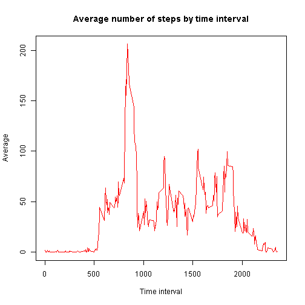
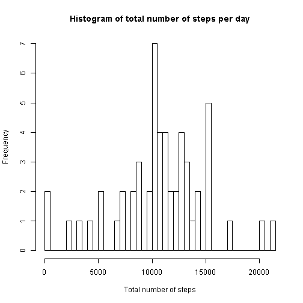
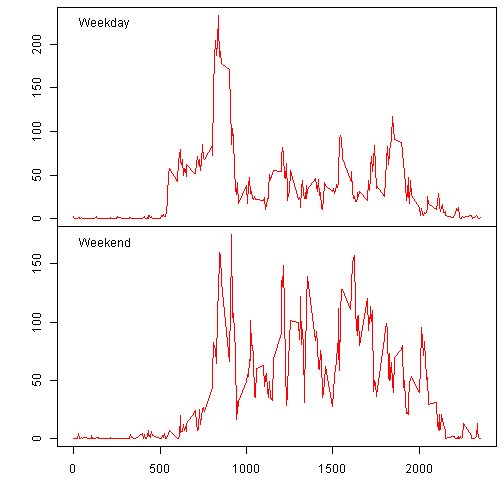

Reproducible Research Assignment
===================================================
<br><br>

### Loading and preprocessing the data


```r
act <- read.csv("activity.csv", header = TRUE)
head(act)
```

```
##   steps       date interval
## 1    NA 2012-10-01        0
## 2    NA 2012-10-01        5
## 3    NA 2012-10-01       10
## 4    NA 2012-10-01       15
## 5    NA 2012-10-01       20
## 6    NA 2012-10-01       25
```
<br><br>

### What is mean total number of steps taken per day?

#### Load dplyr

```r
library(dplyr)
```

```
## 
## Attaching package: 'dplyr'
```

```
## The following objects are masked from 'package:stats':
## 
##     filter, lag
```

```
## The following objects are masked from 'package:base':
## 
##     intersect, setdiff, setequal, union
```
<br><br>


#### Total number of steps taken each day

```r
library(dplyr)
totByDay <- act %>% group_by(date) %>% summarise(sum(steps))
str(totByDay)
```

```
## Classes 'tbl_df', 'tbl' and 'data.frame':	61 obs. of  2 variables:
##  $ date      : Factor w/ 61 levels "2012-10-01","2012-10-02",..: 1 2 3 4 5 6 7 8 9 10 ...
##  $ sum(steps): int  NA 126 11352 12116 13294 15420 11015 NA 12811 9900 ...
```
<br><br>


#### Histogram of the total number of steps taken each day

```r
hist(totByDay$`sum(steps)`, breaks = 50, main = "Histogram of total number of steps per day", xlab = "Total number of steps")
```


<br><br>

#### Mean and median of the total number of steps per day

```r
sMean <- mean(totByDay$`sum(steps)`, na.rm = TRUE)
sprintf("The mean is %s", sMean)
```

```
## [1] "The mean is 10766.1886792453"
```

```r
sMedian <- median(totByDay$`sum(steps)`, na.rm = TRUE)
sprintf("The median is %s", sMedian)
```

```
## [1] "The median is 10765"
```
<br><br>

### What is the average daily activity pattern?

#### Time series plot of the 5-minute interval (x-axis) and the average number of steps taken, averaged across all days (y-axis)

```r
avgByTime <- act %>% group_by(interval) %>% summarise(mean(steps, na.rm = TRUE))
plot(x = avgByTime$interval, y = avgByTime$`mean(steps, na.rm = TRUE)`, type = "l", xlab = "Time interval", ylab = "Average", main = "Average number of steps by time interval", col = "red")
```


<br><br>

#### Which 5 minutes interval contains the maximum number of steps?

```r
avgByTimeSorted <- avgByTime %>% arrange(desc(`mean(steps, na.rm = TRUE)`))
sprintf("The maximum number of steps is contained in the interval %s", avgByTimeSorted[1,1])
```

```
## [1] "The maximum number of steps is contained in the interval 835"
```
<br><br>

### Imputing missing values

#### Calculate and report the total number of missing values in the dataset

```r
sprintf("The total number of missing values is %s", sum(is.na(act$steps)))
```

```
## [1] "The total number of missing values is 2304"
```
<br><br>

To replace the missing values I will use the average number of steps calculated at the same time interval and the already available avgByTime data frame.

#### Create a new dataset that is equal to the original dataset but with the missing data filled in

```r
idx <- which(is.na(act$steps))
act2 <- act
head(act2)
```

```
##   steps       date interval
## 1    NA 2012-10-01        0
## 2    NA 2012-10-01        5
## 3    NA 2012-10-01       10
## 4    NA 2012-10-01       15
## 5    NA 2012-10-01       20
## 6    NA 2012-10-01       25
```

```r
act2$steps[idx] <- subset(avgByTime, interval == act2$interval[idx])$`mean(steps, na.rm = TRUE)`
head(act2)
```

```
##       steps       date interval
## 1 1.7169811 2012-10-01        0
## 2 0.3396226 2012-10-01        5
## 3 0.1320755 2012-10-01       10
## 4 0.1509434 2012-10-01       15
## 5 0.0754717 2012-10-01       20
## 6 2.0943396 2012-10-01       25
```
<br><br>

#### Make a histogram of the total number of steps taken each day

```r
totByDay2 <- act2 %>% group_by(date) %>% summarise(sum(steps))
hist(totByDay2$`sum(steps)`, breaks = 50, main = "Histogram of total number of steps per day", xlab = "Total number of steps")
```


<br><br>

#### Calculate and report the mean and median total number of steps taken per day

```r
sMean <- mean(totByDay2$`sum(steps)`, na.rm = TRUE)
sprintf("The mean is %s", sMean)
```

```
## [1] "The mean is 10766.1886792453"
```

```r
sMedian <- median(totByDay2$`sum(steps)`, na.rm = TRUE)
sprintf("The median is %s", sMedian)
```

```
## [1] "The median is 10765.5943396226"
```

These values do not differ from the mean and median calculated earlier. They are almost identical.
The impact of the estimate on the total number of steps is minimal, as it can be clearly seen comparing the 2 histograms, which look almost identical.
<br><br>

### Are there differences in activity patterns between weekdays and weekends?

#### Create a new factor variable in the dataset with two levels - "weekday" and "weekend"
(sorry I have to use a little Italian here, due to my locale settings)

```r
we <- c("sabato", "domenica")
act2$dayType <- ifelse(weekdays(as.Date(act2$date)) %in% we, "weekend", "weekday")
table(act2$dayType)
```

```
## 
## weekday weekend 
##   12960    4608
```
<br><br>

#### Plot comparing weekend and weekday activities
(I could not make the plot look exactly like the example with the base plotting system...)

```r
avgByTimeWD <- subset(act2, dayType == "weekday") %>% group_by(interval) %>% summarise(mean(steps, na.rm = TRUE))
avgByTimeWE <- subset(act2, dayType == "weekend") %>% group_by(interval) %>% summarise(mean(steps, na.rm = TRUE))
par(mfrow=c(2,1))
par(mar = c(0, 0, 0, 0), oma = c(4, 4, 0.5, 0.5))
plot(x = avgByTimeWD$interval, y = avgByTimeWD$`mean(steps, na.rm = TRUE)`, type = "l", xlab = "", ylab = "Average", col = "red", xaxt = 'n')
legend("topleft", "Weekday", bty="n")
plot(x = avgByTimeWE$interval, y = avgByTimeWE$`mean(steps, na.rm = TRUE)`, type = "l", xlab = "Time interval", ylab = "Average", col = "red")
legend("topleft", "Weekend", bty="n")
```


<br><br>
